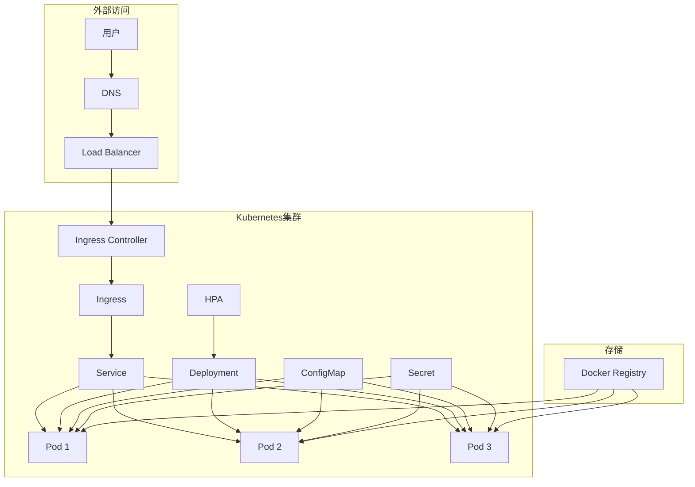

# Kubernetes 部署指南

## 🚢 概述

本文档描述如何将课程管理系统前端部署到Kubernetes集群中。项目已完全支持K8S容器化部署，包含完整的配置文件和自动化脚本。

## 📋 目录

- [前置要求](#前置要求)
- [部署架构](#部署架构)
- [快速部署](#快速部署)
- [配置文件说明](#配置文件说明)
- [监控和维护](#监控和维护)
- [故障排除](#故障排除)

## 前置要求

### 1. Kubernetes集群

**集群要求:**
- Kubernetes 1.19+
- 至少2个工作节点
- 每个节点至少2GB内存
- 支持LoadBalancer类型的Service

**必需组件:**
```bash
# Ingress Controller (推荐使用Nginx)
kubectl apply -f https://raw.githubusercontent.com/kubernetes/ingress-nginx/controller-v1.8.1/deploy/static/provider/cloud/deploy.yaml

# Metrics Server (用于HPA)
kubectl apply -f https://github.com/kubernetes-sigs/metrics-server/releases/latest/download/components.yaml

# Cert-Manager (用于自动TLS证书)
kubectl apply -f https://github.com/cert-manager/cert-manager/releases/download/v1.13.0/cert-manager.yaml
```

### 2. 本地工具

**必需工具:**
- `kubectl` - Kubernetes命令行工具
- `docker` - 用于构建镜像
- `helm` (可选) - 包管理工具

**安装验证:**
```bash
kubectl version --client
docker --version
helm version # 如果使用Helm
```

## 部署架构

### 🏗️ 架构图



### 📊 资源配置

| 组件 | 副本数 | CPU请求 | CPU限制 | 内存请求 | 内存限制 |
|------|--------|---------|---------|----------|----------|
| Frontend | 3 | 100m | 500m | 128Mi | 512Mi |
| HPA最小 | 2 | - | - | - | - |
| HPA最大 | 10 | - | - | - | - |

## 快速部署

### 方法一: 使用部署脚本（推荐）

**Linux/macOS:**
```bash
# 构建镜像
docker build -t course-management-frontend:v1.0.0 .

# 推送到Registry (如果使用远程Registry)
docker tag course-management-frontend:v1.0.0 your-registry.com/course-management-frontend:v1.0.0
docker push your-registry.com/course-management-frontend:v1.0.0

# 部署到K8S
cd k8s
chmod +x deploy.sh
./deploy.sh v1.0.0 your-domain.com
```

**Windows:**
```powershell
# 构建镜像
docker build -t course-management-frontend:v1.0.0 .

# 部署到K8S
cd k8s
.\deploy.ps1 -ImageTag "v1.0.0" -Domain "your-domain.com"
```

### 方法二: 手动部署

```bash
# 1. 创建命名空间
kubectl create namespace course-management

# 2. 应用配置文件
kubectl apply -f k8s/configmap.yaml -n course-management
kubectl apply -f k8s/secret.yaml -n course-management

# 3. 部署应用
kubectl apply -f k8s/deployment.yaml -n course-management
kubectl apply -f k8s/service.yaml -n course-management

# 4. 配置Ingress
kubectl apply -f k8s/ingress.yaml -n course-management

# 5. 启用自动扩缩容
kubectl apply -f k8s/hpa.yaml -n course-management
```

## 配置文件说明

### 1. Deployment (deployment.yaml)

**核心特性:**
- **多副本部署**: 默认3个副本，确保高可用
- **滚动更新**: 零停机时间更新
- **健康检查**: 存活探针和就绪探针
- **资源限制**: CPU和内存限制
- **安全配置**: 非root用户运行

**关键配置:**
```yaml
spec:
  replicas: 3
  strategy:
    type: RollingUpdate
    rollingUpdate:
      maxSurge: 1
      maxUnavailable: 1
```

### 2. Service (service.yaml)

**服务类型:**
- **ClusterIP**: 集群内部访问
- **LoadBalancer**: 外部负载均衡器访问

**端口配置:**
```yaml
ports:
- name: http
  port: 80
  targetPort: 80
  protocol: TCP
```

### 3. Ingress (ingress.yaml)

**功能特性:**
- **SSL终止**: 自动HTTPS重定向
- **域名路由**: 支持多域名
- **静态资源优化**: 缓存和压缩
- **安全头**: XSS保护、内容类型嗅探防护

**TLS配置:**
```yaml
tls:
- hosts:
  - your-domain.com
  secretName: frontend-tls-secret
```

### 4. ConfigMap (configmap.yaml)

**应用配置:**
```yaml
data:
  deploy-env: "production"
  api-base-url: "https://api.your-domain.com"
  app-title: "课程管理系统"
```

**Nginx配置:**
- Gzip压缩
- 静态资源缓存
- API代理
- 健康检查端点

### 5. HPA (hpa.yaml)

**自动扩缩容规则:**
```yaml
metrics:
- type: Resource
  resource:
    name: cpu
    target:
      type: Utilization
      averageUtilization: 70
```

## 监控和维护

### 1. 部署状态检查

```bash
# 查看Pod状态
kubectl get pods -l app=course-management-frontend -n course-management

# 查看部署状态
kubectl get deployment course-management-frontend -n course-management

# 查看HPA状态
kubectl get hpa course-management-frontend-hpa -n course-management
```

### 2. 日志查看

```bash
# 查看所有Pod日志
kubectl logs -l app=course-management-frontend -n course-management -f

# 查看特定Pod日志
kubectl logs <pod-name> -n course-management -f

# 查看Ingress Controller日志
kubectl logs -n ingress-nginx -l app.kubernetes.io/name=ingress-nginx -f
```

### 3. 性能监控

```bash
# 查看资源使用情况
kubectl top pods -l app=course-management-frontend -n course-management

# 查看节点资源
kubectl top nodes

# 查看HPA指标
kubectl describe hpa course-management-frontend-hpa -n course-management
```

### 4. 扩缩容操作

```bash
# 手动扩容
kubectl scale deployment course-management-frontend --replicas=5 -n course-management

# 查看扩容状态
kubectl get deployment course-management-frontend -n course-management -w

# 更新镜像
kubectl set image deployment/course-management-frontend frontend=course-management-frontend:v1.1.0 -n course-management
```

## 故障排除

### 常见问题

#### 1. Pod无法启动

**症状**: Pod状态为Pending或CrashLoopBackOff

**排查步骤:**
```bash
# 查看Pod详细信息
kubectl describe pod <pod-name> -n course-management

# 查看Pod日志
kubectl logs <pod-name> -n course-management

# 查看事件
kubectl get events -n course-management --sort-by='.lastTimestamp'
```

**可能原因:**
- 镜像拉取失败
- 资源不足
- 配置错误
- 存储问题

#### 2. 服务无法访问

**症状**: 外部无法访问应用

**排查步骤:**
```bash
# 检查Service
kubectl get svc -n course-management
kubectl describe svc course-management-frontend-service -n course-management

# 检查Ingress
kubectl get ingress -n course-management
kubectl describe ingress course-management-frontend-ingress -n course-management

# 检查Ingress Controller
kubectl get pods -n ingress-nginx
```

**可能原因:**
- Ingress Controller未安装
- DNS配置错误
- 防火墙阻塞
- 证书问题

#### 3. HPA不工作

**症状**: 自动扩缩容不生效

**排查步骤:**
```bash
# 检查Metrics Server
kubectl get pods -n kube-system | grep metrics-server

# 检查HPA状态
kubectl describe hpa course-management-frontend-hpa -n course-management

# 查看资源指标
kubectl top pods -n course-management
```

**可能原因:**
- Metrics Server未安装
- 资源请求未设置
- 指标收集延迟

### 性能优化

#### 1. 镜像优化

```dockerfile
# 使用多阶段构建减小镜像体积
FROM node:18-alpine AS builder
# ... 构建步骤

FROM nginx:alpine
# 只复制必要文件
COPY --from=builder /app/dist /usr/share/nginx/html
```

#### 2. 资源调优

```yaml
resources:
  requests:
    cpu: 100m      # 根据实际负载调整
    memory: 128Mi
  limits:
    cpu: 500m      # 防止资源过度使用
    memory: 512Mi
```

#### 3. 缓存策略

```yaml
# Nginx配置中的缓存设置
location ~* \.(js|css|png|jpg|jpeg|gif|ico|svg)$ {
  expires 1y;
  add_header Cache-Control "public, immutable";
}
```

### 安全加固

#### 1. 网络策略

```yaml
apiVersion: networking.k8s.io/v1
kind: NetworkPolicy
metadata:
  name: frontend-network-policy
spec:
  podSelector:
    matchLabels:
      app: course-management-frontend
  policyTypes:
  - Ingress
  - Egress
  ingress:
  - from:
    - namespaceSelector:
        matchLabels:
          name: ingress-nginx
    ports:
    - protocol: TCP
      port: 80
```

#### 2. Pod安全策略

```yaml
securityContext:
  runAsNonRoot: true
  runAsUser: 101
  fsGroup: 101
  capabilities:
    drop:
    - ALL
  readOnlyRootFilesystem: true
```

#### 3. 资源配额

```yaml
apiVersion: v1
kind: ResourceQuota
metadata:
  name: frontend-quota
spec:
  hard:
    requests.cpu: "2"
    requests.memory: 4Gi
    limits.cpu: "4"
    limits.memory: 8Gi
    count/pods: "10"
```

## 生产环境最佳实践

### 1. 多环境管理

```bash
# 使用不同命名空间
kubectl create namespace course-management-dev
kubectl create namespace course-management-staging
kubectl create namespace course-management-prod
```

### 2. 配置管理

```bash
# 使用Kustomize管理多环境配置
kustomize build overlays/production | kubectl apply -f -
```

### 3. 备份策略

```bash
# 备份配置
kubectl get all,configmaps,secrets -n course-management -o yaml > backup.yaml

# 定期备份
kubectl get all -n course-management -o yaml | gzip > backup-$(date +%Y%m%d).yaml.gz
```

### 4. 监控告警

```yaml
# Prometheus监控配置
apiVersion: monitoring.coreos.com/v1
kind: ServiceMonitor
metadata:
  name: frontend-monitor
spec:
  selector:
    matchLabels:
      app: course-management-frontend
  endpoints:
  - port: http
```

---

## 🆘 获取帮助

- **Kubernetes文档**: https://kubernetes.io/docs/
- **Nginx Ingress**: https://kubernetes.github.io/ingress-nginx/
- **Cert-Manager**: https://cert-manager.io/docs/
- **项目Issues**: 提交到项目GitHub仓库

## 📚 相关文档

- [Docker部署指南](DEPLOYMENT.md)
- [Jenkins CI/CD](JENKINS.md)
- [项目README](README.md)
